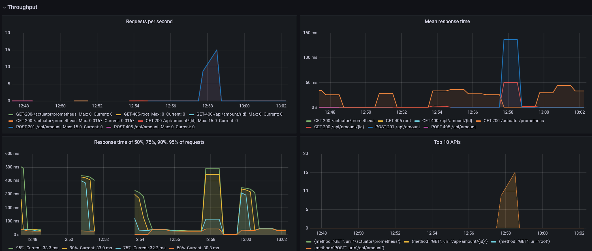

## Исследование AccountService'а

### Цель: создать сервис и оценить время доступа к нему в зависимости от входных параметров

### Используемые технологии
- Java 8
- Maven
- Spring Boot
- PostgreSQL
- Swagger 2
- Prometheus
- Grafana

Сервис позволят получать баланс юзера по id и добавлять/вычитать баланс 

Сервис кэширует данные в памяти и сохраняет данные в PostgreSQL

Для запуска приложения необходимо запустить

Статистику можно просматривать с помощью Grafana можно воспользоваться [ссылкой](http://localhost:3000/d/twqdYjziz/micrometer-spring-throughput?orgId=1)

## Запуск

### Требования
1. `java 8`
2. `Maven`
3. `docker`
4. `docker-compose`

### Процесс запуска
1. Запустить `PostgreSQL`, `prometheus` и `grafana`, сконфигурированные в `docker-compose.yml` с помощью команды в директории проекта
```shell
docker-compose up -d --build
```
2. Выполнить команду `mvn clean install`
3. Установить переменные окружения
```shell
DATABASE_URL=jdbc:postgresql://localhost:5432/balance_db
DATABASE_PASSWORD=postgres
DATABASE_USER=postgres
```
4. В директории target запустить исполяемый jar-архив `java -jar serviceAccessTimeEstimate-0.0.1-SNAPSHOT.jar`
5. Сервер будет доступен на порту `8080` по умолчанию, для его изменения при запуске можно задать аргумент `--server.port=$port`
6. `Swagger` документация будет доступна по адресу `http://localhost:8080/swagger-ui/`

### Статистика

Для сбора статистики используется популярное решение prometheus + grafana

1. Сервер для `prometheus` запускается на порту `9000`
2. Сервер для `grafana` запускается на порту `3000`
3. Для доступа к интерфейсу статистики необходимо перейти по адресу `http://localhost:3000`
4. Сырые данные статистика доступны на `/actuator/`
4. По умолчанию данные для входа `admin`, `admin`
5. Для grafana используются 2 дашборда: `Micrometer Spring Throughput`, `JVM (Micrometer)`
6. В первом отображается информация о запросах, во втором JVM статистика

Пример `Micrometer Spring Throughput`

